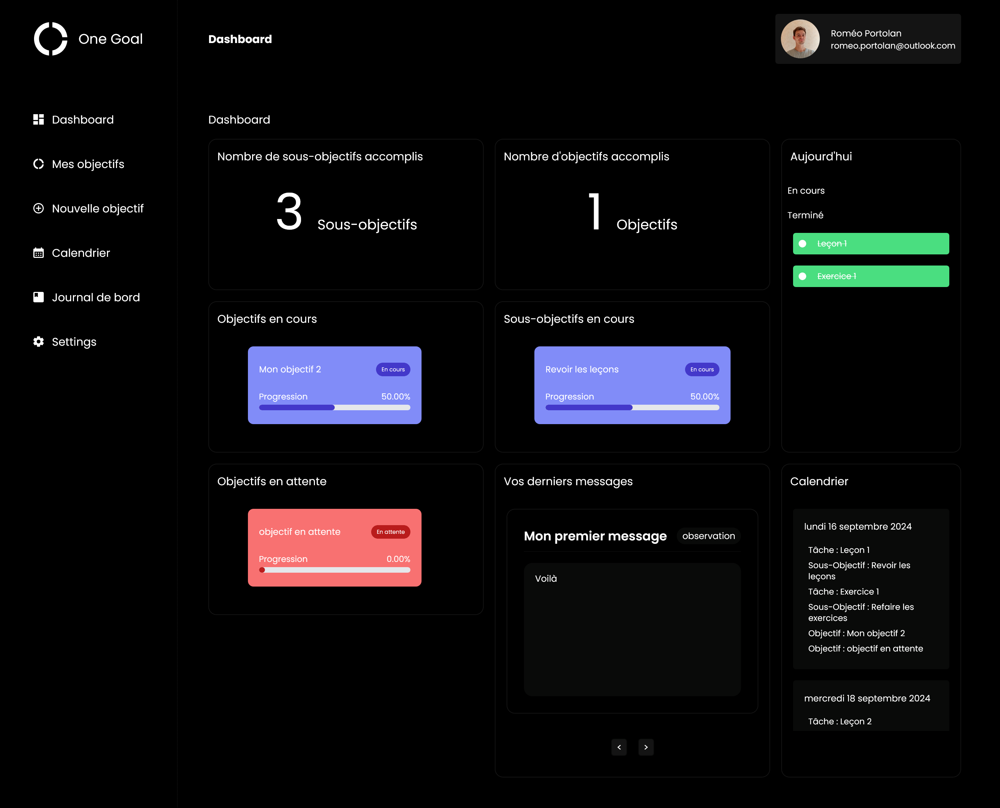

# 🏆 OneGoal - Goal Tracker

OneGoal est une application web permettant de **créer, gérer et structurer des objectifs** de manière avancée. Grâce à son interface intuitive et son système de suivi performant, il aide les utilisateurs à organiser leurs objectifs en sous-objectifs et tâches, tout en visualisant leur progression.

---

## ✨ Fonctionnalités principales

✅ **Authentification sécurisée**  
- Inscription et connexion avec hachage des mots de passe (**bcrypt**)  
- Vérification d'email via **Nodemailer** (anti-bot)  
- Gestion des sessions avec **JWT**  

✅ **Gestion avancée des objectifs**  
- Création d’objectifs et sous-objectifs imbriqués  
- Ajout de tâches associées à chaque sous-objectif  
- Modification et suppression des objectifs/tâches  
- Gestion visuelle et interactive des objectifs via un **calendrier**  

✅ **Suivi de progression**  
- Interface dynamique affichant l’évolution des objectifs  
- Dashboard interactif avec **indicateurs de progression**    

✅ **Backend robuste**  
- API REST codée en **Node.js + Express**  
- Base de données **MySQL** gérée manuellement avec un script SQL  
- Sécurité renforcée avec **validation des entrées** et protections anti-injections SQL  

✅ **Frontend ergonomique**  
- Développé en **React** avec une UI moderne et **TailwindCSS**  
- Composants réutilisables pour une meilleure maintenabilité
- Expérience utilisateur fluide et responsive
- Architecture en Atomic Design

---

## 🚀 Technologies utilisées

| Technologie        | Description |
|-------------------|-------------|
| **Frontend**     | React, TailwindCSS, React Router |
| **Backend**      | Node.js, Express, Sequelize |
| **Base de données** | MySQL |
| **Authentification** | JWT, bcrypt |
| **Sécurité**     | Nodemailer, Helmet, Validation des entrées |
| **Gestion des requêtes** | Axios |
| **Autres**       | dotenv (gestion des variables d’environnement), CORS |

---

## 📸 Aperçu du projet

> **Ajoute ici des captures d'écran de l'interface** pour illustrer le projet.  
> Exemple :  
> 
> 


---

## 🛠 Étapes pour installer et utiliser OneGoal

### 1️⃣ Cloner le projet
```bash
git clone https://github.com/rportolan/onegoal.git
cd onegoal
```

---

### 2️⃣ Installer les dépendances
```bash
cd backend
npm install
cd ../frontend
npm install
```

---

### 3️⃣ Configurer les fichiers `.env`

#### 📂 Backend : `backend/.env`
1. Copiez le fichier d'exemple et renommez-le :
```bash
cp backend/.env.example backend/.env
```
2. Configurez les variables :
```env
JWT_SECRET=VotreCléTrèsSecrète
EMAIL_USER=VotreEmail@gmail.com
EMAIL_PASSWORD=MotDePasseDApplication
FRONTEND_URL=http://localhost:5173

DB_NAME=one_goal
DB_USER=root
DB_PASSWORD=
DB_HOST=localhost
DB_PORT=3306
DB_DIALECT=mysql
```
- **Générez votre `JWT_SECRET`** avec :
  ```bash
  node -e "console.log(require('crypto').randomBytes(64).toString('hex'))"
  ```
- **Créez un mot de passe d'application Gmail** ici 👉 [https://myaccount.google.com/apppasswords](https://myaccount.google.com/apppasswords)

#### 📂 Frontend : `frontend/.env`
1. Copiez et renommez :
```bash
cp frontend/.env.example frontend/.env
```
2. Configurez l’URL de l'API backend :
```env
VITE_BACKEND_URL=http://localhost:3000
```

---

### 4️⃣ Créer la base de données MySQL avec un script

#### ✅ Avec phpMyAdmin
1. Ouvrez **phpMyAdmin**.
2. Créer une nouvelle base de donnée "one_goal" en utilisant l'interclassement "utf8mb4_general_ci"
3. Importez le fichier `backend/database.sql`.
4. Les tables seront créées automatiquement.

---

### 5️⃣ Lancer le projet

**⚠️ Avant de lancer le backend, installez `nodemon` globalement :**
```bash
npm install -g nodemon
```

**Backend** :
```bash
cd backend
nodemon start
```
**Frontend** :
```bash
cd frontend
npm run dev
```
**Accédez au site ici** 👉 `http://localhost:5173`

---

### 6️⃣ Créer un compte et utiliser OneGoal
- ✅ Inscrivez-vous (n'oubliez pas de vérifier votre email)
- ✅ Connectez-vous
- ✅ Commencez à gérer vos objectifs 🎯

---

## 🤝 Contribution & Contact

💡 **Des idées ou suggestions ?** Ouvrez une issue ou envoyez-moi un message.

📬 **Me contacter :**  
📧 Email : [romeoprtl.dev@gmail.com](mailto:romeoprtl.dev@gmail.com)  
💼 LinkedIn : https://www.linkedin.com/in/romeo-portolan-a89459184/

---

## 📜 Licence

Ce projet est sous licence **MIT** – [Voir le fichier LICENSE](LICENSE) pour plus d’informations.

